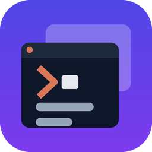

# AI Workspace Session Manager

**English** | [Tiếng Việt](README.vi.md)

A VS Code extension that manages **multiple global workspaces**, each holding **multiple open
terminals** — both terminals you open by hand and terminals running Claude Code. No manifest
lives inside your repo: each workspace is stored as its own file in the extension's global storage
(`workspaces/<id>.json`) and updates itself continuously while you work — there is no manual Save
button. Open VS Code, and the "AI Workspaces" tree shows your existing workspaces; click one
to activate it, and the extension reopens exactly the terminals from your last session,
resuming the right Claude Code conversation (if any) or re-running the recorded
`startCommand`.

## Requirements

- VS Code ≥ 1.93 (uses the Terminal Shell Integration API for accurate cwd tracking)
- VS Code Shell Integration working (on by default with PowerShell/bash/zsh) — needed for
  auto-remembering running apps and accurate cwd updates
- Claude Code ≥ 2.1 (the `claude` command available on PATH) — only needed for
  `kind: claude` terminals

## Key features

- **Global workspace list**: not tied to a specific folder/repo; one workspace can hold
  terminals pointing at many different repos/folders.
- **Adoption**: while a workspace is active,
  - a terminal you open yourself with <kbd>Ctrl+Shift+`</kbd> (unnamed, not a task runner) →
    **added automatically** to the active workspace, with a toast offering "Remove" in case
    it was added by mistake;
  - a terminal created by a task runner/another extension (custom name) → a toast suggests
    adding it; it only joins the workspace if you click "Add";
  - any open terminal can be added manually via the terminal tab's right-click menu
    (**AI Workspace: Add open terminal to workspace**) — if no workspace is active, the
    command asks you to pick/create one (without activating it).
- **Auto-save**: every change (add/remove terminal, rename, session attach, cwd change,
  workspace activate/close) is saved with a 500 ms debounce to `workspaces.json`, written
  via temp+rename (atomic) — there is no manual Save action anywhere.
- **Reattach instead of resuming twice**: after a VS Code window reload, VS Code revives the
  old terminals with the Claude processes still running inside them. Activating a workspace
  first reattaches to those terminals — by the persistent entry ID embedded at terminal creation,
  by process ancestry for live Claude sessions, or by a unique name + cwd for legacy terminals —
  and only opens what is genuinely missing. Ambiguous legacy Codex groups are kept alive and
  skipped rather than guessed/adopted. Without this, every reload adds another `--resume` process to a
  conversation that is already running, and several processes end up writing the same
  session file.
- **Activate / switch workspaces**: click an inactive workspace → each saved terminal is
  reopened. If another workspace is currently active, the extension shows a modal
  "Save and close X before opening Y?" before switching; cancelling does nothing.
- **Claude terminals** (`kind: claude`): on reopen the extension sends
  `claude --resume '<sessionId>' -n '<claudeName>'`; if the entry never had a sessionId
  (freshly created), the extension mints a new uuid, sends `--session-id`, and flushes to
  disk BEFORE sending the command (no orphaned sessions if VS Code dies mid-launch).
- **Plain terminals** (`kind: plain`): tracks the shell (name + cwd) and **auto-remembers
  the running app** — the extension listens to Shell Integration events: any command that
  runs for 15 seconds or more (dev server, ssh, watcher…) automatically becomes the
  `startCommand`, written to disk the moment the command *starts* (nothing is lost if
  VS Code dies mid-run); trivial commands (`ls`, `git status`…) are filtered out. The next
  workspace activation re-runs exactly that app — no explicit declaration needed. You can
  still set/edit it manually via **AI Workspace: Set start command for terminal**. On
  reopen, if the `startCommand` is not yet trusted, the extension shows a modal quoting the
  command verbatim, with "Trust and run" or "Open shell only". Changing the `startCommand`
  (including via auto-capture) invalidates the old trust (fingerprint changes) — the next
  activation asks for trust again.
- **Not Claude-only — Codex conversations are restored too**: *New Codex terminal* opens the
  terminal and then **discovers the session id** from `~/.codex/sessions` (Codex has no
  pin-the-id flag like Claude's `--session-id`, so it must be found after the fact). On reopen,
  a command picker puts the exact saved session first; without an id it defaults to
  `codex resume --last`, followed by the session picker and a new session. The original
  full-access flag is preserved: `codex --yolo` becomes `codex --yolo resume --last` or
  `codex --yolo resume <id>`. Escape skips that terminal without creating an empty shell.
  Codex has no running-session registry, so there is **no busy/idle status**, only "open". Other tools
  (gemini, opencode…) are still restored at the app level through `startCommand`, and if they
  have their own resume command you can set it via *Set start command for terminal*.
- **Automatic Claude session capture**: every ~3 seconds the extension matches the cwd of
  open terminals in the active workspace against `claude agents --json` (only
  `kind: interactive` rows). A unique match → `claudeSessionId`/peer name attached
  automatically, and the `plain` terminal is "promoted" to `claude`. Multiple terminals with
  the same cwd / multiple sessions in the same cwd → the extension **walks the process
  ancestry** (the session's pid, walked up its ancestor chain, must reach exactly one
  terminal's shell pid) to resolve deterministically; only what remains unresolvable shows a
  QuickPick, asked once per cwd group (not re-asked every poll cycle if you dismiss it).
  Process ancestry runs first and is not limited to same-cwd groups: a session belongs to the
  terminal whose shell is its process ancestor, whatever cwd the entry recorded (you `cd`'d
  elsewhere before starting Claude), and that evidence also **corrects a wrong claim** — if
  another entry holds that session id, it is released so the real terminal gets it. An
  existing session id is only ever re-pointed on process evidence, never on a cwd guess, so
  an entry whose conversation has exited keeps its id and stays resumable.
  When you **close a workspace**, the extension runs one final capture sweep and re-asks
  even the groups you previously dismissed — after closing there is no way left to capture.
  If the machine can't resolve it, attach manually via **"Assign Claude session to
  terminal"** on the terminal item in the tree.
- **One active workspace per VS Code window**: best-effort lock via `activeWindowId`;
  opening the same workspace in a second window shows a warning with an "Open anyway"
  override.
- **Closing a terminal does not remove it from the workspace**: closing a terminal by hand
  (the X button or `exit`) only moves the entry to the "not open" state in the tree — the
  workspace still remembers it, and reactivating the workspace reopens it. To remove it for
  good, use **AI Workspace: Remove terminal from workspace**.
- **Deleting a workspace does not close real terminals**: deleting a workspace from the list
  only forgets it — its real open terminals keep running untouched.

## Commands

| Command | Command ID | Context |
|---|---|---|
| AI Workspace: Create new workspace | `aiWorkspace.createWorkspace` | Palette / "+" button on the view |
| AI Workspace: Activate workspace | `aiWorkspace.activateWorkspace` | Click item / context menu of an inactive workspace |
| AI Workspace: Close workspace | `aiWorkspace.closeWorkspace` | Palette / context menu of an open workspace (bottom group, with confirmation modal). Only that workspace closes — the others stay open. |
| AI Workspace: Clean worktrees | `aiWorkspace.cleanWorktrees` | Context menu of a workspace. Lists worktrees under `<repo>-worktrees/` with their state; never uses `--force` or `-D`. |
| AI Workspace: Show workspace info | `aiWorkspace.showWorkspaceInfo` | Workspace context menu — id, last activation, owning window, terminal location, store file path and every terminal with its cwd/start command/session; "Copy info" / "Open store file" |
| AI Workspace: Workspace settings | `aiWorkspace.workspaceSettings` | Workspace context menu — per-workspace terminal location (follow global / editor area / bottom panel) |
| AI Workspace: Rename workspace | `aiWorkspace.renameWorkspace` | Workspace context menu |
| AI Workspace: Delete workspace | `aiWorkspace.deleteWorkspace` | Workspace context menu (with confirmation modal) |
| AI Workspace: New Claude terminal | `aiWorkspace.newClaudeTerminal` | Palette / workspace context menu — asks for a path, then a worktree name (leave empty to work in the path itself; the worktree is created next to the repo as `<repo>-worktrees/<name>`, never inside it), then arrow-key through command variants (new session / `-c` / `-r`, each with a `--dangerously-skip-permissions` twin); the terminal opens there immediately, named after the folder |
| AI Workspace: New Codex terminal | `aiWorkspace.newCodexTerminal` | Palette / workspace context menu — asks for ONE path, then how to run (`codex`, `codex resume --last`, `codex resume`, plus `--yolo` variants); the session id is discovered from `~/.codex/sessions`, and reopen offers exact id / last / picker / new |
| AI Workspace: New terminal | `aiWorkspace.newPlainTerminal` | **"+" button on the workspace row** (hover) / palette / workspace context menu — asks for ONE path, opens a plain terminal there (added to the workspace, apps auto-captured as usual) |
| AI Workspace: Rename terminal | `aiWorkspace.renameTerminal` | Terminal item context menu — or use VS Code's built-in Rename on the terminal tab; the name syncs back to the tree within ~3 seconds |
| AI Workspace: Show terminal path | `aiWorkspace.showTerminalPath` | Terminal item context menu — shows the full cwd with "Copy path" / "Open folder" (also visible in the item's hover tooltip) |
| AI Workspace: Set start command for terminal | `aiWorkspace.setStartCommand` | `plain` terminal context menu |
| AI Workspace: Remove terminal from workspace | `aiWorkspace.removeTerminal` | Terminal context menu — an open terminal prompts for close-and-remove / remove-only / cancel |
| AI Workspace: Open terminal | `aiWorkspace.focusTerminal` | Click a terminal item in the tree |
| AI Workspace: Add open terminal to workspace | `aiWorkspace.addOpenTerminalToWorkspace` | Terminal tab right-click menu / palette |
| AI Workspace: Assign AI session to terminal | `aiWorkspace.assignClaudeSession` | Terminal item context menu — a Claude terminal picks from running sessions; a Codex terminal picks from recent sessions read out of `~/.codex/sessions` (same-cwd first) |

**Keyboard shortcuts** (change or remove them in *Keyboard Shortcuts*, search `aiWorkspace`):

| Key | Command |
|---|---|
| <kbd>Ctrl+Alt+T</kbd> (macOS <kbd>Cmd+Alt+T</kbd>) | New terminal |
| <kbd>Ctrl+Alt+A</kbd> (macOS <kbd>Cmd+Alt+A</kbd>) | New Claude terminal |

Invoked by keyboard, the terminal goes straight into the **active workspace** with no picker;
the picker only appears when no workspace is active.

The "AI Workspaces" tree (in Explorer, view id `aiWorkspace.workspaces`) has 2 levels:
level 1 is the workspace list (sorted by most recently active, the active workspace gets its
own badge), level 2 is each workspace's terminals with a status label (running / idle /
**WAITING FOR YOU** / **loading session… with a spinning icon** / open / not open / error), refreshed
every ~3 seconds while the view is visible (polling stops when the view is hidden). The
loading state shows from the moment a Claude terminal is opened/restored until its session
appears in the registry (capped at 90 s), so a slow workspace activation never looks frozen.

**Picking the working folder**: both "New terminal" commands ask for the folder through a
searchable picker — type a few characters to filter the folders you have used before (recent
history → cwds of known terminals → open workspace folders); paste a full path only when it
is not in the list. A path typed by hand always appears as the first entry, flagged
`không tồn tại` if it isn't on disk, and the picker stays open so you can fix a typo. The last
entry, **"Duyệt tìm thư mục…"**, opens the OS folder dialog — it starts at whatever path you
were typing (or its parent) and falls back to your most recent folder. Cancelling that dialog
returns to the picker with your text intact instead of aborting the whole command.

**"Waiting for you" is not "idle"**: Claude's registry only reports `busy`/`idle`, and "idle"
covers both *finished* and *stopped mid-task waiting for you to answer*. The extension reads
the tail of the session transcript: a last tool call with no result yet means Claude is
waiting on you (a choice prompt, or a permission dialog) → the label becomes **CHỜ BẠN TRẢ
LỜI** with a yellow question icon. It only reads while the session is `idle`, and caches by
file mtime, so a waiting session is read exactly once. Not available for Codex: its session
log records no approval-request events.

**Terminal location**: every terminal the extension creates or restores opens as a **tab in
the editor area** by default (setting `aiWorkspace.terminalLocation`, switch to `panel` to
get the classic bottom panel). Each workspace can override this via **AI Workspace:
Workspace settings** in its context menu — the choice is saved with the workspace and
applies to both new and restored terminals. For terminals you open yourself with
<kbd>Ctrl+Shift+`</kbd>, use VS Code's own setting
`terminal.integrated.defaultLocation: "editor"`.

## Safety principles

- Never runs a `startCommand` that has not been explicitly trusted (trust is fingerprinted
  on the command's content; changing the command invalidates the old trust).
- Never closes real terminals when deleting a workspace or removing a terminal from one.
- A corrupt/unparseable `workspaces.json` → backed up to `workspaces.json.bak-<epoch>` and
  the list is re-initialised empty, with a one-time warning — corrupt data is never silently
  discarded.
- A terminal whose `--resume` id no longer maps to a conversation: the extension does not
  intervene; the terminal still opens and the error shows directly inside it; the entry
  keeps its id so you can fix it by hand / retry.

## Known limitations

- No migration from the MVP data model (the old in-repo `workspace.yaml` manifest) — v2 is a
  completely different data model (global storage, not a file in the repo).
- Shell content/history is not restored — only Claude Code conversations resume via
  `--resume`; plain terminals just reopen at the right cwd and run the `startCommand`
  (if any).
- No workspace auto-activates when VS Code opens — the tree only shows the list; you pick.
- The "one active workspace per window" lock is best-effort only (no heartbeat, no hard
  lock); killing a window abruptly can leave a stale lock — the other window uses "Open
  anyway" to get out of that state.
- Two entries in two different workspaces can point at the same `claudeSessionId`: session
  matching only looks at the active workspace, so it can't know a session was already
  claimed by another workspace. Activating both workspaces will `--resume` the same
  conversation twice.
- Multiple VS Code windows: every save merges by id, and **each window only overwrites the
  workspaces it has touched itself** (created, renamed, activated, added/removed
  terminals…). Untouched workspaces follow the latest copy on disk, so another window's
  ongoing work is not clobbered. Each workspace's state is therefore that of the last window
  to touch it.
- Deleting a workspace in one window can be undone by another window that still holds it in
  RAM and has touched it — its next save may resurrect it.
- Codex has no running-session registry, so Codex terminals have **no busy/idle status** (only
  "open") and are not matched by process ancestry the way Claude terminals are.
- The `agentId`/`agentSessionId` fields (used by Codex) are **new**: any VS Code window still
  running an older build — including a window **not yet reloaded after the update** — ignores
  them and drops them on its next save, **even for workspaces it does not own** (the on-disk
  copy it reads has already been stripped). The conversation is not lost: the id also lives in
  `startCommand` (`codex resume <id>`), so it still restores the right conversation — only the
  `Codex` label and the session-assignment branch fall back to a plain terminal. Reload every
  window after updating the extension and it goes away.
- No multi-machine workspace management, no workspace sharing via git.

## Development

```bash
npm install
npm test              # 116 unit/integration tests (vitest) — pure core, no vscode API
npm run test:vscode   # 6 smoke tests running inside a real Extension Host
npm run typecheck     # tsc --noEmit
npm run build         # bundle with esbuild into dist/extension.js
```

Press <kbd>F5</kbd> in VS Code (using the "Run Extension" configuration in
`.vscode/launch.json`) to open an Extension Host window with the extension running in debug
mode — use that window to run the manual test checklist in `docs/manual-verification.md`,
since most dialog-driven flows (modals, toasts, QuickPicks) cannot be tested automatically
in a headless Extension Host.
